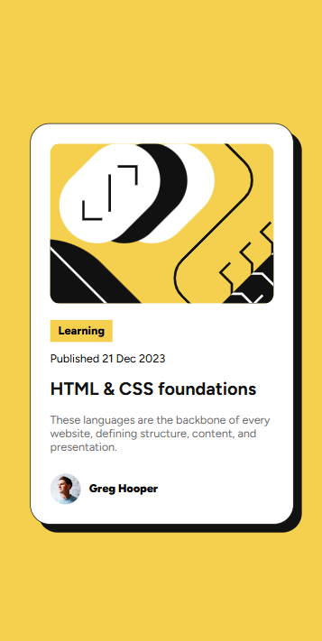

# Frontend Mentor - Blog preview card

## Welcome! 👋

Thanks for checking out this front-end coding challenge.

This challenge was provided by [Frontend Mentor](https://www.frontendmentor.io), a website that helps you to pratice frontend skills by building "real world" projects.

## Summary

- [The challenge](#the-challenge)
- [Screenshots](#screenshots)
- [Technolohies](#technologies)
- [Links](#links)

## The challenge

The chanllenge was develop a blog preview card with: img, title, description and author infos, as name and profile picture; the card uses vibrant and high contrast colors what gives it a modern vibe, that is getting bigger these days.

## Screenshots

    
Desktop view

    

    
Mobile view

    

## Technologies

- HTML
- CSS

## Links

- [My Linkedin](https://www.linkedin.com/in/evandee-silva/)
- [My page on frontendmentor](https://www.frontendmentor.io/profile/EvandeeMoS)
- [The challenge page](https://www.frontendmentor.io/challenges/blog-preview-card-ckPaj01IcS)

